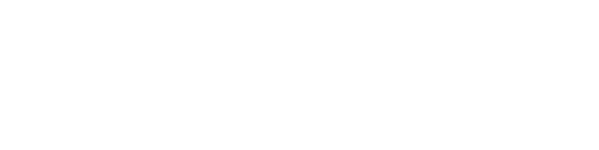

# Project for testing SPRING 7.x and SPRING BOOT 4.x IoC and DI

# Поиск зависимостей
## test02 - CDL
Зависимый объект --> Поиск --> Контейнер

# Внедрение зависимостей
## test03 - Внедрение зависимостей через конструктор с помощью аннотаций

Класс аннотируем 
```java
@Service("constructorConfusion")
```

чтобы он появился в контексте
```java
ConstructorConfusion cc = (ConstructorConfusion) ctx.getBean("constructorConfusion");
```

В классе определяем для конструктора автосвязывание
```java
    @Autowired
    public ConstructorConfusion(String someValue) {
        System.out.println("ConstructorConfusion(String) called");
        this.someValue = someValue;
    }
```

В app-context-annotation.xml объявляем бин
```xml
<bean id="message" class="java.lang.String"
          c:_0="Test string"/>
```
Если объявим еще один такой же бин, то будет ошибка

Прописываем область сканирования компонентов
```xml
    <context:component-scan
            base-package="juhnowski.test03"/>
```

## test04 - Внедрение зависимостей через конструктор с помощью xml

Имеем класс с двумя конструкторами
```java
public ConstructorConfusion(String someValue) ...
public ConstructorConfusion(int someValue) ...
```

В app-context-xml.xml прописываем бин с конструктором
```xml
    <bean id="constructorConfusion"
          class="juhnowski.test04.ConstructorConfusion">
    <constructor-arg type="int">
        <value>90</value>
    </constructor-arg>
</bean>
```

Получаем компонент из контекста
```java
ConstructorConfusion cc = (ConstructorConfusion) ctx.getBean("constructorConfusion");
```

# test05 - Внедрение зависимостей через конструктор с помощью xml

Имеем класс, реализующий иннтерфейс
```java
ConfigurableMessageProvider implements MessageProvider...
```

с конструктором
```java
  public ConfigurableMessageProvider(String message) 
```

прописываем бин
```xml
<bean id="provider"
          class="juhnowski.test05.ConfigurableMessageProvider"
          c:message="I hope that someone gets my message in a bottle"/>
```

Извлекаем компонент из контекста
```java
MessageProvider messageProvider = ctx.getBean("provider",
                MessageProvider.class);
```

## test06 - внедрение зависимостей через сеттер
Аннотируем класс
```java
@Service("renderer")
public class StandardOutMessageRenderer implements MessageRenderer {
```
и в нем сеттер
```java
    @Autowired
    public void setMessageProvider(MessageProvider provider) 
```

Создаем компонент для аргумента сеттера
```java
@Component("provider")
public class HelloWorldMessageProvider implements MessageProvider
```

Прописываем сканирование компонентов для автосвязывания
```java
@ComponentScan(basePackages = {"juhnowski.test06"})
@Configuration
public class HelloWorldConfiguration { }
```

## test07 - фабрика

используется класс DefaultListaЬleBean
Factory в качестве одной из двух основных реализаций интерфейса BeanFactory,
предоставляемых в Spring, а данные типа BeanDefinition читаются из ХМL-файла
средствами класса XmlBeanDefinitionReader. Как только реализация интерфейса
BeanFactory будет создана и сконфигурирована, компонент Spring Bean извлекается
по его имени oracle, указанному в ХМL-файле конфигурации

## test08 - встраивание простых типов
Аннотация @Value

## test09 - встраивание простых типов
Аннотация @Value("#{injectSimpleConfig.ageInSeconds}")

## test10 - inject-ref
Внедрение компоненнтов SpringBeans в однном и том же блоке XML-разметки с помощью дескриптора разметки <ref>

Конфигурируем внедряемый компонент
```xml
<bean id="oracle" name="wiseworm" class="juhnowski.test10.BookwormOracle"/>
```

Конфигурируем цель внедрения
```xml
<bean id="injectRef" class="juhnowski.test10.InjectRef">
        <property name="oracle">
            <ref bean="wiseworm"/>
        </property>
    </bean>
```

но можно и по id:
```xml
<ref bean="oracle"/>
```

Внедряемый тип не должен в точности совпадать с тем типом, который определен в качестве целевого.
Оба типа должны быть просто совместимы.

Совместимость означает, что если тип, объявленный в качестве целевого:
- интерфейс, то внедряемый тип должен реализовывать этот интерфейс.
- класс, то внедряемый тип должен относится к тому же самому типу или его подтипу.

## test11 - вложенные контексты 
Spring позволяет компонентам Spring Beans из порожденного контекста ссылаться нна компоненты 
в родительском контексте.

Вызвать метод setParent() в порожденном контексте типа ApplicationContext
```java
        GenericXmlApplicationContext parent = new GenericXmlApplicationContext();
        parent.load("classpath:spring/parent-context.xml");
        parent.refresh();

        GenericXmlApplicationContext child = new GenericXmlApplicationContext();
        child.load("classpath:spring/child-context.xml");
        child.setParent(parent);
        child.refresh();
```
Если в дочернем контексте присутствует бин с тем же именем, что и в родительском, то атрибут bean в
дескрипторе <ref> надо заменить на <parent>
```xml
<ref parent="childTitle"/>
```

## test12 - annotated collection injection
## test13 - xml collection injection

## test14 - внедрение зависимостей через метод поиска и xml

Неодиночный компонент
```java
public class Singer {
    private String lyric = "I played a quick game of chess with the salt and pepper shaker";

    public void sing() {
        System.out.println(lyric);
    }
}
```

Интерфейс 
```java
public interface DemoBean {
    /**
     * Если этот компонент с методом поиска, то метод выполняет конкретный поиск
     * @return ссылка на экземпляр Singer
     */
    Singer getMySinger();
    /**
     * Действие этого метода зависит от класса Singer
     */
    void doSomething();
}
```
для двух одиночных компонентов
```java
public class StandardLookupDemoBean implements DemoBean
public abstract class AbstractLookupDemoBean implements DemoBean
```

Конфигурация в формате xml, извлекаем их
```java
GenericXmlApplicationContext ctx = new GenericXmlApplicationContext();
        ctx.load("classpath:spring/app-context-xml.xml");
        ctx.refresh();
```

ссылки на них передаются методу displayInfo
```java
    displayInfo("abstractLookupBean", abstractBean);
    displayInfo("standardLookupBean", standardBean);
```
В методе создаем две локальные переменные типа Singer
```java
        Singer singer1 = bean.getMySinger();
        Singer singer2 = bean.getMySinger();
```
Выводим сообщение в консоль, что ссылки указывают на один и тот же объект
```java
System.out.println("[" + beanName + "]: Singer Instances the Same?  "
                + (singer1 == singer2));
```
При каждом вызове метода getMySinger():
- abstractLookupBean - при каждом вызове извлекается новый экземпляр типа Singer, так как метод абстрактный и каждый раз происходит внедрение  
- standardLookupBean - один и тот же компонент, так как одиночный экземпляр типа Singer передается этому компоненту путем внедрения зависимостей через метод установки. Этот экземпляр сохраняется и возвращается при каждом вызове метода getMyySinger(), и поэтому обе ссылки должны совпадать.

Результат работы:
```declarative
[abstractLookupBean]: Singer Instances the Same?  false
100000 gets took 93 ms
[standardLookupBean]: Singer Instances the Same?  true
100000 gets took 0 ms
```
## test15 - - внедрение зависимостей через метод поиска и аннотации
AbstractLookupDemoBean теперь не абстрактный:
```java
    @Lookup("singer")
    public Singer getMySinger() {
        return null; // This implementation will be overridden by dynamically generated subclass
    }
```
и singer - имя компонента типа Singer.
Переменную не объявляем, так как DI через метод

Результат работы медленнее
```declarative
[abstractLookupBean]: Singer Instances the Same?  false
100000 gets took 105 ms
[standardLookupBean]: Singer Instances the Same?  true
100000 gets took 0 ms
```